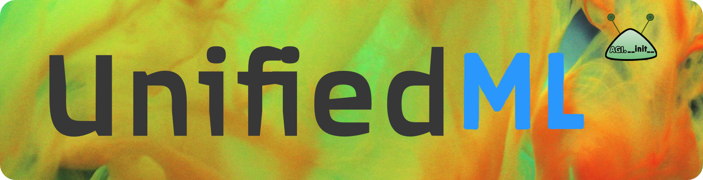

[comment]: <> (# Unified ML, unified in one place, ml, it's so unified )

[comment]: <> (# Unified ML)




### Quick Links

- [Setup](#-wrench--setting-up)

- [Examples](#-mag--example-scripts)

- [Agents and performances](#-bar-chart--agents---performance)


[comment]: <> (- [Citing]&#40;https://github.com/slerman12/UnifiedML2#pen-paper--citing&#41;)

# :runner: Running The Default

To start a train session, once installed:

```
python Run.py
```

[comment]: <> (The default agent and task are DQN and Pong respectively.)

Defaults:

```Agent=Agents.DQNAgent```

```task=atari/pong```

Plots, logs, and videos are automatically stored in: ```./Benchmarking```.


## Welcome ye, weary Traveller.

>Stop here and rest at our local tavern,
>
> Where all your reinforcements and supervisions be served, à la carte!

**Drink up!** :beers:


# :pen: Paper & Citing

For detailed documentation, see our [[**Papér**](https://arxiv.com)].

[comment]: <> (Please see [paper]&#40;https://arxiv.com&#41; for more details.)

[comment]: <> (### How is this possible?)

[comment]: <> (**RL**: All agents implement our "Creator"/"DPG" framework to support both continuous and discrete action spaces.)

[comment]: <> (**Classification**: treated as a reinforcement learning suite called "Classify" akin to Atari or DMC, with datasets re-framed as tasks that yield labels rather than rewards.)

[comment]: <> (**Generative** modeling reframes the Actor-Critic as a Generator-Discriminator, a surprisingly simple RL-GAN unification.)

[comment]: <> (## Citing The Hard Worker Who Labored For You Day And Mostly Day)

[comment]: <> (## Citing)

```
@inproceedings{yarats2021image,
  title={bla},
  author={Sam Lerman and Chenliang Xu},
  booktitle={bla},
  year={2022},
  url={https://openreview.net}
}
```
If you use any part of this code, **be sure to cite the above!**

[comment]: <> (### Also)

An acknowledgment to [Denis Yarats](https://github.com/denisyarats), whose excellent [DrQV2 repo](https://github.com/facebookresearch/drqv2) inspired much of this library and its design.

# :open_umbrella: Unified Learning?
Yes.

All agents support discrete and continuous control, classification, and generative modeling.

See example scripts [below](https://github.com/slerman12/UnifiedML2#point_up-simple-scripts).

# :wrench: Setting Up 

[comment]: <> (Pretty simple:)

Let's get to business.

## 1. Clone The Repo

```
git clone github.com/agi-init/UnifiedML
cd UnifiedML
```

## 2. Gemme Some Dependencies

```
conda env -f create Conda.yml
```

[comment]: <> (# Installing Suites)

## 3. Activate Your Conda Env.

```
conda activate ML
```

[comment]: <> (*zip zap bippidy bap!* ~ &#40;don't run that&#41;)

[comment]: <> (### *THERE, HAPPY!??*)

# :joystick: Installing The Suites 

## 1. Classify

[comment]: <> (Comes preinstalled.  :smirk:)
Comes preinstalled. 

## 2. Atari Arcade

You can use ```AutoROM``` if you accept the license.

```
pip install autorom
AutoROM --accept-license
```
Then:
```
mkdir Atari_ROMS
AutoROM --install-dir ./Atari_ROMS
ale-import-roms ./ATARI_ROMS
```
## 3. DeepMind Control
Download MuJoCo from here: https://mujoco.org/download.

Make a ```.mujoco``` folder in your home directory:

```
mkdir ~/.mujoco
```

Unrar, unzip, and move (```unrar```, ```unzip```, and ```mv```) downloaded MuJoCo version folder into ```~/.mujoco```. 

And run:
```
pip install git+https://github.com/deepmind/dm_control.git
```

to install DeepMind Control.

Voila.

[comment]: <> (***Voila.***)

# :mag: Sample scripts

[comment]: <> (Plots are automatically generated during training and stored in:)

[comment]: <> (```./Benchmarking/<experiment>/Plots/```.)

[comment]: <> (### *Atari example:*)

[comment]: <> (```)

[comment]: <> (python Run.py task=atari/breakout)

[comment]: <> (```)

[comment]: <> (All agents support all suites, discrete and continuous control.)

### RL

Humanoid example: 
```
python Run.py task=dmc/humanoid_run
```

DrQV2 Agent in Atari:
```
python Run.py Agent=Agents.DrQV2Agent task=atari/battlezone
```

SPR Agent in DeepMind Control:
```
python Run.py Agent=Agents.SPRAgent task=dmc/humanoid_walk
```

### Classification

DQN Agent in CIFAR-10:
```
python Run.py Agent=Agents.DQNAgent task=classify/cifar10 RL=false
```

[comment]: <> (*Note:* ```RL=false``` sets training to standard supervised-only classification. Without ```RL=false```, an additional RL phase joins the supervised learning with . )
*Note:* ```RL=false``` sets training to standard supervised-only classification. Without ```RL=false```, an additional RL phase joins the supervised learning plase s.t. ```reward = -error```.

### Generative Modeling

Via the ```generate=true``` flag:
```
python Run.py task=classify/mnist generate=true
```
```
python Run.py task=atari/breakout generate=true
```

### Experiment naming

The ```experiment=``` flag can differentiate a distinct experiment; you can optionally control which experiment data is automatically plotted with ```plotting.plot_experiments=```.

```
python Run.py experiment=ExpName1 "plotting.plot_experiments=['ExpName1']"
```

[comment]: <> (Also, manual plotting via ```Plot.py```:)

[comment]: <> (```)

[comment]: <> (python Plot.py <experiment1> <experiment2> <...>)

[comment]: <> (```)

[comment]: <> (```)

[comment]: <> (python Run.py task=atari/breakout generate=true)

[comment]: <> (```)


[comment]: <> (And if you use any part of this code — even look at it, or think about it — **be sure to cite the above!**)

[comment]: <> (And if you use any part of this code, **be sure to cite the above!**)


[comment]: <> (## :thinking: Details)

# :bar_chart: Agents & Performances

[comment]: <> (```)

[comment]: <> (@inproceedings{yarats2021image,)

[comment]: <> (  title={Image Augmentation Is All You Need: Regularizing Deep Reinforcement Learning from Pixels},)

[comment]: <> (  author={Denis Yarats and Ilya Kostrikov and Rob Fergus},)

[comment]: <> (  booktitle={International Conference on Learning Representations},)

[comment]: <> (  year={2021},)

[comment]: <> (  url={https://openreview.net/forum?id=GY6-6sTvGaf})

[comment]: <> (})

[comment]: <> (```)

[comment]: <> (**Feel free to cite also the above!**)


[comment]: <> (# :paperclips: Repository Structure)

[comment]: <> (Files are succinct, intuitive, and try to be self-explanatory.)

[comment]: <> (* Agents are self-contained in their respective ```./Agents``` file.)

[comment]: <> (* ```Run.py``` handles all training, evaluation, and logging.)

[comment]: <> (* ```./Datasets``` includes ```Environment.py```, which handles the environment "roll out," and ```ExperienceReplay.py``` which stores and retrieves data using parallel CPU workers.)

[comment]: <> (* Architectures, losses, probability distributions, and simple helpers defined in ```./Blocks```, ```./Losses```, ```Distributions.py``` and ```Utils.py``` respectively.)

[comment]: <> (* Hyper-param default configurations in ```.\Hyperparams```.)

# :interrobang: How is this possible

We use our new Creator framework to unify RL discrete and continuous action spaces, as elaborated in our [paper](https://arxiv.com).

Then we frame actions as "predictions" in supervised learning. We can even augment supervised learning with an RL phase, treating reward as negative error.

For generative modeling, well, it turns out that the difference between a Generator-Discriminator and Actor-Critic is rather nominal.

[comment]: <> (# :paperclips: Repository Structure)

[comment]: <> (Agents are self-contained in their respective ```./Agents``` file.)

[comment]: <> (```Run.py``` handles all training, evaluation, and logging.)

[comment]: <> (```./Datasets``` includes ```Environment.py```, which handles the environment "roll out," and ```ExperienceReplay.py``` which stores and retrieves data using parallel CPU workers.)

[comment]: <> (Architectures, losses, probability distributions, and simple helpers defined in ```./Blocks```, ```./Losses```, ```Distributions.py``` and ```Utils.py``` respectively.)

[comment]: <> (Hyper-param default configurations in ```.\Hyperparams```.)

[comment]: <> (Files are succinct, intuitive, and try to be self-explanatory.)

# :mortar_board: Pedagogy and Research

All files are designed to be useful for educational and innovational purposes in their simplicity and structure.


# Note

### If you are only interested in the RL portion, 

Check out our [**UnifiedRL**](https:github.com/agi-init/UnifiedRL) library. 

It does with RL to this library what PyCharm does with Python to IntelliJ, i.e., waters it down mildly and rebrands a little.~

[comment]: <> (# License)

<hr class="solid">

[comment]: <> (## License)

[MIT License Included.](https://github.com/agi-init/UnifiedML/MIT_LICENSE)

[comment]: <> (## Financing)

[comment]: <> (If you have not yet, please consider donating:)

[comment]: <> ([comment]: <> &#40;[![Donate]&#40;https://img.shields.io/badge/Donate-PayPal-green.svg?style=social&#41;]&#40;https://www.paypal.com/cgi-bin/&#41;&#41;)

[comment]: <> ([![Donate]&#40;https://img.shields.io/badge/Donate-PayPal-green.svg?style=flat&#41;]&#40;https://www.paypal.com/cgi-bin/&#41;)

[comment]: <> ([comment]: <> &#40;[![Donate]&#40;https://img.shields.io/badge/Donate-PayPal-green.svg?style=for-the-badge&#41;]&#40;https://www.paypal.com/cgi-bin/&#41;&#41;)

[comment]: <> ([comment]: <> &#40;[![Donate]&#40;https://img.shields.io/badge/PayPal-Donate-green.svg?style=for-the-badge&#41;]&#40;https://www.paypal.com/cgi-bin/&#41;&#41;)

[comment]: <> ([comment]: <> &#40;[![Donate]&#40;https://img.shields.io/badge/Give_money-yasss-green.svg?style=for-the-badge&#41;]&#40;https://www.paypal.com/cgi-bin/&#41;&#41;)

[comment]: <> ([comment]: <> &#40;[![Donate]&#40;https://img.shields.io/badge/paypal-green.svg?style=for-the-badge&#41;]&#40;https://www.paypal.com/cgi-bin/&#41;&#41;)

[comment]: <> (We are a nonprofit, single-PhD student team whose bank account is quickly hemmoraging.)

[comment]: <> (If you are an investor wishing to invest more seriously, [please contact **agi.\_\_init\_\_**]&#40;mailto:agi.init@gmail.com&#41;.)

[comment]: <> (Mark Zuckerburg, if you're looking for an heir... &#40;not joking&#41;.)